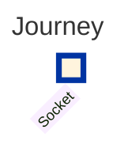
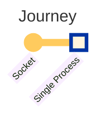
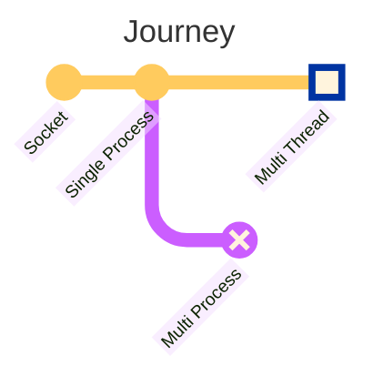
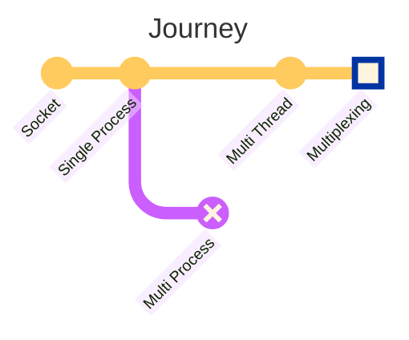
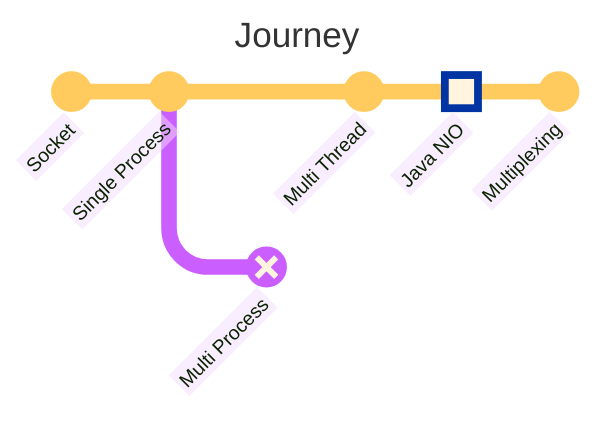

## 概要

複数のクライアントリクエストを同時に処理できるサーバーアプリケーションを実装することは今では非常に簡単です。Spring MVCだけを使えばすぐに実現できます。しかし、エンジニアとして、私はその基本原則に興味を持っています。この記事では、当たり前に思えることに疑問を投げかけることで、マルチコネクションサーバーを実装するために行われた考慮事項について振り返ります。

:::info

[GitHub](https://github.com/songkg7/journey-to-a-multi-connect-server)でサンプルコードを確認できます。

:::

## ソケット



最初の目的地は「ソケット」です。ネットワークプログラミングの観点から、ソケットはネットワークを介してデータを交換するためのファイルのように使用される通信エンドポイントです。"ファイルのように使用される"という表現は重要であり、ファイルディスクリプタ（fd）を介してアクセスされ、ファイルと同様のI/O操作をサポートしています。

:::info[なぜソケットはポートではなくfdで識別されるのか？]

ソケットはIP、ポート、他のパーティのIPとポートを使用して識別できますが、fdを使用する方が好まれます。なぜなら、ソケットは接続が受け入れられるまで情報がなく、fdのような単純な整数だけでは不十分なデータが必要だからです。

:::

ソケットを使用してサーバーアプリケーションを実装するには、以下の手順を踏む必要があります：

<!-- 省略 -->


- `socket()` でソケットを作成
- `bind()`、`listen()` で接続の準備
- `accept()` で接続を受け入れ
- 接続を受け入れた直後に別のソケットを割り当てる = 他の接続を受け入れられる必要がある

接続に使用されるソケットはリスニングソケットと呼ばれます。このリスニングソケットは接続を受け入れるだけであり、各クライアントとの通信には別のソケットが作成されて使用されます。

サーバーアプリケーションの実装方法を見てきましたが、次はJavaでサーバーアプリケーションを実装してみましょう。

## シングルプロセスサーバー



```java
try (ServerSocket serverSocket = new ServerSocket(PORT)) {
    while (true) {
        try (
                Socket clientSocket = serverSocket.accept();
                BufferedReader in = new BufferedReader(new InputStreamReader(clientSocket.getInputStream()));
                PrintWriter out = new PrintWriter(clientSocket.getOutputStream(), true)
        ) {
            String inputLine;
            while ((inputLine = in.readLine()) != null) {
                System.out.println("Echo: " + inputLine);
            }
            System.out.println("Client disconnected.");
        } catch (IOException e) {
            System.out.println("Exception in connection with client: " + e.getMessage());
        }
    }
} catch (IOException e) {
    System.out.println("Could not listen on port " + PORT + ": " + e.getMessage());
}
```

1. ポートを `ServerSocket` にバインドし、無限ループでクライアントリクエストを待機します。
2. クライアントリクエストが発生すると、`accept()` を呼び出して接続を受け入れ、新しい `Socket` を作成します。
3. ストリームを使用してデータの読み書きを行います。

先に説明したソケットの概念を使用して、シンプルなサーバーアプリケーションが完成しました。この記事を読んでいるあなたも、フレームワークを使用せずにサーバーアプリケーションを実装できるようになりました 🎉。

しかし、このサーバーアプリケーションにはいくつかの欠点があります。複数のリクエストを同時に処理するのが難しいです。単一プロセスで動作するため、一度に1つのリクエストしか処理できず、前の接続が終了するまで次のリクエストを処理できません。

例を見てみましょう。


hello1の応答は問題なく返ってきますが、hello2の応答はhello1の接続が終了してから到着することがわかります。

- 単一クライアントが接続する場合には問題ありませんが、複数のクライアントが接続すると問題が発生します。
- 複数のクライアントが接続すると、最初の接続が終了するまで後続のクライアントはキューで待機する必要があります。
- 複数のリクエストを同時に処理できないことは、リソースの効率的な利用を妨げます。

この問題に対処するために、2つのアプローチが考えられます：

- マルチプロセス
- マルチスレッド

Javaで直接マルチプロセスを扱うのは難しいです。その後悔は置いておいて、マルチスレッドに移りましょう。

## マルチスレッドサーバー



```java
try (ServerSocket serverSocket = new ServerSocket(PORT)) {
    LOGGER.info("Server is running on port " + PORT);

    while (true) {
        Socket clientSocket = serverSocket.accept(); // メインスレッドがリクエストを受け入れてクライアントソケットを作成
        new Thread(new ClientHandler(clientSocket)).start(); // ワーカースレッドに委任
    }
} catch (IOException e) {
    LOGGER.severe("Could not listen on port " + PORT + ": " + e.getMessage());
}
```

```java
public class ClientHandler implements Runnable {
    // 省略...

    @Override
    public void run() {
        try (
                BufferedReader in = new BufferedReader(new InputStreamReader(clientSocket.getInputStream()));
                PrintWriter out = new PrintWriter(clientSocket.getOutputStream(), true)
        ) {
            String inputLine;
            while ((inputLine = in.readLine()) != null) {
                out.println("Echo: " + inputLine); // 受信したメッセージをエコーバック
            }
        } catch (IOException e) {
            LOGGER.severe("Error handling client: " + e.getMessage());
        } finally {
            try {
                clientSocket.close();
            } catch (IOException e) {
                LOGGER.severe("Failed to close client socket: " + e.getMessage());
            }
        }
    }
}
```


各リクエストごとに新しいスレッドを作成することで、複数のリクエストを同時に処理できるようになりました。では、ここで旅は終わりでしょうか？JVMの特性を考慮すると、さらなる最適化の余地があるように見えます。

- **スレッドの作成と管理はリソースを消費するタスク** であり、Javaはスレッドを作成する際にスタック領域を割り当て、CPUアーキテクチャによっては約1MBになることがあります。
- もし10,000のリクエストが同時に発生した場合、サーバーはスレッドリソースだけで10GB以上のメモリが必要になります。
- サーバーリソースが無限ではないため、スレッドの最大数を制限する必要があります。これが **スレッドプール** の概念が登場する理由です。
- Spring MVCはこれらの考えに基づいて開発されました。

最適化が完了しました。[いくつかの実験](https://haril.dev/blog/2023/11/10/Spring-MVC-Traffic-Testing)を通じて、このフレームワークが [c10k問題](http://www.kegel.com/c10k.html) を簡単に処理できることが証明されました。しかし、何かが違和感を覚えるのはなぜでしょうか 🤔。

- スレッドがブロックされるほど、アプリケーションの動作が非効率になります。これはコンテキストスイッチ中に競合が発生するためです。
- スレッドは、ソケットにデータが到着したかどうかを確認して読み取るために、限られたCPUリソースを競合します。
- 言い換えれば、ネットワークリクエストの数が増えるにつれて、アプリケーションの処理が遅くなります。
- **スレッドプールを使用すると、同時に処理できるリクエストの最大数に制限がある** ことを意味します。
- より高い目標を目指すエンジニアとして、この制限を突破したいと考えています。

## マルチプレクシングサーバー



スレッドがブロックされることは、サーバーアプリケーションにとって負担が大きいです。スレッドがブロックされることなく多くのリクエストを処理する方法は何でしょうか？

答えはマルチプレクシングにあります。マルチプレクシングは、少ないスレッドで多くのリクエストを処理できる技術です。マルチプレクシングを使用することで、約10万の同時接続を容易に処理できるサーバーを実装できます。今回の旅のメインコースです。

マルチプレクシングに入る前に、JavaのI/Oを理解する必要があります。

### Java NIO



Java NIOは、既存のI/O APIを置き換えるためにJDK 1.4以降で導入されたAPIです。なぜJava I/Oが遅かったのでしょうか？

- Javaはカーネルメモリに直接アクセスできなかったため、カーネルバッファをJVMメモリにコピーする処理が必要で、ブロッキングモードで動作していました。
- データがJVMメモリ（ヒープ）にコピーされた後、ガベージコレクションが必要で、追加のオーバーヘッドが発生しました。
- NIOは、カーネルメモリに直接アクセスできるAPIである ByteBuffer を導入しました。
- これにより、カーネルスペースからのコピーが不要となり、ゼロコピーが実現されました。

Java NIOには3つの主要なコンポーネントがあります：**Channel、Buffer、Selector**。

#### Channel

サーバーとクライアント間でデータを交換する際に、チャネルはバッファ（ByteBuffer）を使用してデータの読み書きを行います。

- FileChannel: ファイルへのデータ