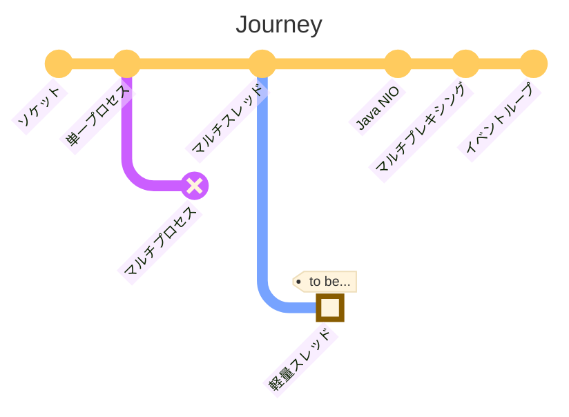

2024년 5월 21일, 다중 접속 서버로의 여정


## 개요

여러 클라이언트 요청을 동시에 처리할 수 있는 서버 애플리케이션을 구현하는 것은 이제 매우 쉬워졌습니다. Spring MVC만 사용해도 쉽게 구현할 수 있습니다. 그러나 엔지니어로서, 그 이면의 원리에 대해 궁금해합니다. 이번 글에서는 당연하게 여겨지는 것들에 대해 '왜'라는 질문을 던지며, 다중 접속 서버를 구현하기 위한 고민을 되짚어보겠습니다.

:::info

예제 코드는 [GitHub](https://github.com/songkg7/journey-to-a-multi-connect-server)에서 확인할 수 있습니다.

:::

## 소켓(Socket)

먼저 '소켓'에서 시작합니다. 네트워크 프로그래밍 관점에서 소켓은 '네트워크상에서 데이터를 주고받기 위해 파일처럼 사용되는 통신 엔드포인트'입니다. '파일처럼 사용되는' 이 설명이 중요한데, 파일 디스크립터(file descriptor, fd)를 통해 접근되고 파일과 유사한 I/O 연산을 지원하기 때문입니다.

소켓을 사용하여 서버 애플리케이션을 구현하려면 다음과 같은 과정을 거쳐야 합니다.

- socket()으로 소켓 생성
- bind(), listen()으로 연결 준비
- accept()로 연결 수락
- 수락 후 바로 다른 소켓을 할당 = 다른 연결을 수락할 수 있어야 함

이 때 연결에 사용되는 소켓을 리스닝 소켓이라고 합니다. 이 리스닝 소켓은 연결을 수락하는 역할만 하므로, 클라이언트와의 연결에는 다른 소켓이 별도로 생성되어 사용됩니다.

## 단일 프로세스 서버

```java
try (ServerSocket serverSocket = new ServerSocket(PORT)) {
    while (true) {
        try (
                Socket clientSocket = serverSocket.accept();
                BufferedReader in = new BufferedReader(new InputStreamReader(clientSocket.getInputStream()));
                PrintWriter out = new PrintWriter(clientSocket.getOutputStream(), true)
        ) {
            String inputLine;
            while ((inputLine = in.readLine()) != null) {
                System.out.println("Echo: " + inputLine);
            }
            System.out.println("Client disconnected.");
        } catch (IOException e) {
            System.out.println("Exception in connection with client: " + e.getMessage());
        }
    }
} catch (IOException e) {
    System.out.println("Could not listen on port " + PORT + ": " + e.getMessage());
}
```

소켓 개념을 기반으로 간단한 서버 애플리케이션이 완성되었습니다. 이제 여러분도 프레임워크를 사용하지 않고 서버 애플리케이션을 구현할 수 있게 되었습니다. 그러나 이 서버 애플리케이션에는 여러 가지 한계가 있습니다. **여러 요청을 동시에 처리하기 어렵다**는 점이 그 중 하나입니다.

## 멀티 스레드 서버

멀티 스레드 방식은 하나의 프로세스 안에서 요청이 들어올 때마다 별개의 스레드를 생성하여 처리를 위임하는 방식으로 구현됩니다. 이를 그림으로 나타내면 다음과 같습니다.

클라이언트 관점에서 표현하면 아래와 같습니다.

코드로 구현해보면 아래와 같습니다.

```java
try (ServerSocket serverSocket = new ServerSocket(PORT)) {
    LOGGER.info("Server is running on port " + PORT);

    while (true) {
        Socket clientSocket = serverSocket.accept();
        new Thread(new ClientHandler(clientSocket)).start();
    }
} catch (IOException e) {
    LOGGER.severe("Could not listen on port " + PORT + ": " + e.getMessage());
}
```

이제는 동시에 여러 요청을 처리할 수 있게 되었습니다.

## 멀티 플렉싱 서버

멀티 플렉싱은 적은 스레드로 많은 요청을 처리할 수 있게 하는 기술입니다. 멀티 플렉싱에 대해 자세히 살펴보기 전에 Java의 I/O에 대해 이해할 필요가 있습니다.

### Java NIO

Java NIO는 jdk 1.4부터 도입된 API로, 기존의 I/O API를 대체하기 위해 만들어졌습니다. Java I/O가 느린 이유는 JVM이 커널 메모리 영역에 직접 접근할 수 없었기 때문이었습니다. Java NIO에서는 ByteBuffer를 통해 커널 메모리 영역에 직접 접근할 수 있게 되었습니다.

Java NIO에는 Channel, Buffer, Selector라는 핵심 컴포넌트가 있습니다.

코드로 구현해보면 아래와 같습니다.

멀티 플렉싱 서버를 구현하는 방법을 살펴보았습니다.

## 이벤트 루프(Event Loop)

이벤트 루프는 큐와 같은 자료구조에 이벤트가 발생하는지 무한루프를 돌며 지켜보다가, 이벤트를 처리할 수 있는 적절한 핸들러에 동작을 위임하여 처리하는 개념입니다.

너무 어렵게 느껴지시나요? Netty를 사용해보신 적이 있다면 이미 멀티 플렉싱을 사용하고 계셨을 것입니다. Netty는 NIO 기반의 멀티 플렉싱을 사용하기 쉽도록 만들어진 프레임워크입니다.

```

```java
// イベントループ
while (true) {
    selector.select();
    Set<SelectionKey> selected = selector.selectedKeys();
    for (SelectionKey selectionKey : selected) {
        dispatch(selectionKey);
    }
    selected.clear();
}
```

JVMのメインスレッドは、イベントが発生するまでループ内で待機し、適切なハンドラにイベントを委譲します。

これにより、ノンブロッキングマルチプレキシングサーバーでなぜブロッキング動作を引き起こしてはいけないのかについても理解できます。基本的にメインスレッドのみが動作するため、ループの外でスレッドがブロックされると、selectを呼び出してイベントを委譲する動作自体が遅くなる可能性があるからです。

同様に、計算集中型の作業（＝CPU集中型）はスレッドの動作自体を遅らせるため、イベントループとは相性が悪いです。このような作業が頻繁に発生する場合は、別のスレッドを生成して作業を委任することで、メインスレッドのループを妨げないように実装する必要があります。

## 結論

これまで、マルチコネクションサーバーを実装する際の悩みや一歩一歩を見てきました。

- 単一プロセスでは複数の接続を処理できず、
- マルチプロセスやマルチスレッドはリソースを多く必要としましたが、
    - スレッドプールはリソースの問題を解決しましたが、多くのリクエストを同時に処理するにはまだ不十分でした。
- マルチプレキシングを使用して1つのスレッドでも多くのリクエストを処理できるようにします。
    - どのリクエストが処理の準備ができているかを知ることができるセレクタが重要でした。

この旅はここまでです。何だか寂しい気持ちがします。

あ、実はまだ訪れていない場所が1つ残っています。本当に興味深いトピックですが、次の旅のために取っておきます。



## 参考

- https://engineering.linecorp.com/ko/blog/do-not-block-the-event-loop-part1
- https://mark-kim.blog/understanding-non-blocking-io-and-nio/
- https://oliveyoung.tech/blog/2023-10-02/c10-problem/
```